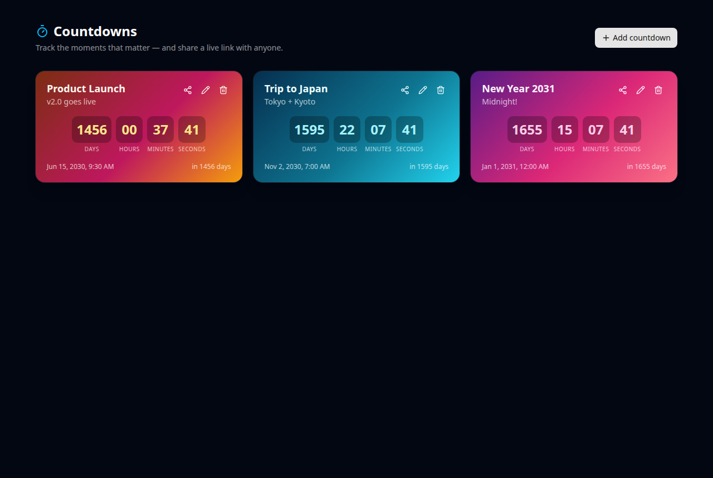
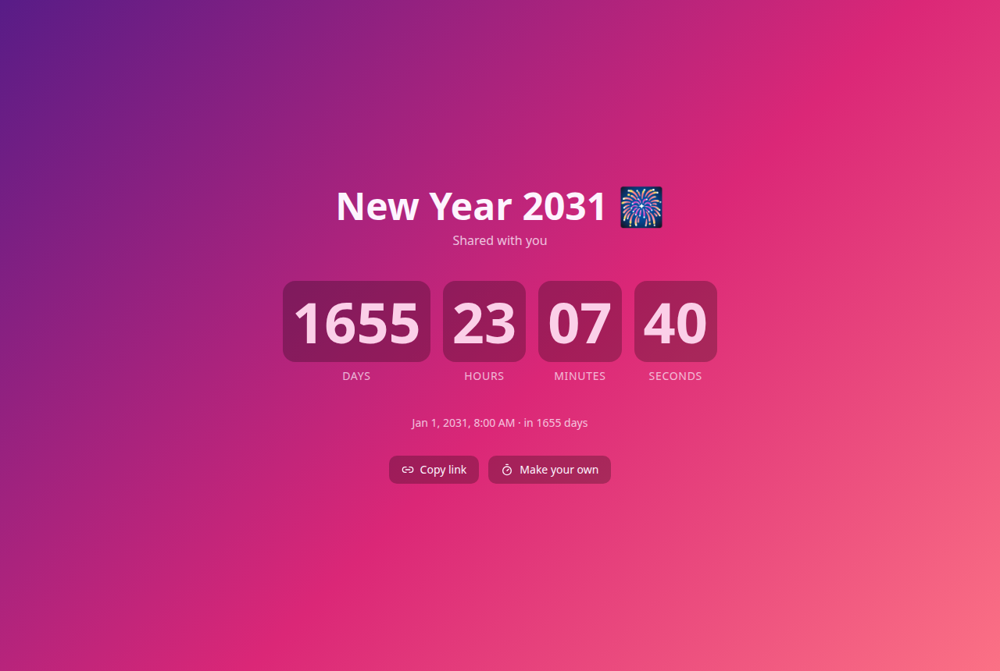

# Countdowns ⏳

[](LICENSE)


Create beautiful countdowns to the moments that matter — and **share a live link
with anyone, no account or backend required.** An installable, offline-capable
PWA built with React 19, Vite, and Tailwind 4.

## Highlights

- **Shareable countdowns, zero backend.** Every countdown encodes into its own
  URL, so a link like `/c/<code>` renders a full-screen live countdown for
  anyone who opens it — no database, no sign-up, nothing to host beyond static
  files.
- **Six themes**, applied live to cards and the shared view.
- **Local dashboard** — create, edit, delete, auto-sorted soonest-first, with a
  celebration state when a countdown completes.
- **Installable PWA** — works offline via a service worker; add it to your home
  screen.
- **Tested & typed** — unit-tested share/codec + countdown logic, strict
  TypeScript, lint and build gates.

## Screenshots

| Dashboard | Shared link (public) |
| --- | --- |
|  |  |

## How sharing works

There's no server. When you click **share** on a card, the event
(`{ title, targetISO, theme, note }`) is serialized to JSON and packed into a
URL-safe, UTF-8-safe base64 string:

```
https://your-host/c/eyJ0aXRsZSI6Ik5ldyBZZWFyIDIwMzEi...
```

Opening that link decodes the payload and renders a live countdown. The target
time is stored in UTC, so the countdown is correct in every timezone. Because
the whole app is static, you can host it anywhere (or run it offline).

## Run it

### npm

```bash
npm install
npm run dev          # http://localhost:5173
```

### Docker

```bash
# Development (hot reload, source bind mount)
docker compose up --build                       # http://localhost:5173

# Production-like (multi-stage build, nginx, SPA routing)
docker compose -f compose.prod.yaml up --build  # http://localhost:4173
```

Set `APP_PORT` in a local `.env` only if a host port is taken. No secrets needed.

## Develop & verify

```bash
npm run lint     # eslint
npm test         # vitest — share codec, countdown math, sorting
npm run build    # tsc -b + vite build
```

## Project structure

```
src/
  lib/share.ts      URL encode/decode for shareable countdowns + sorting
  lib/time.ts       pure countdown math + humanized labels
  lib/themes.ts     theme definitions
  components/        CountdownCard, CountdownList, BigCountdown, EventForm
  pages/Home.tsx     local dashboard
  pages/Shared.tsx   public /c/:code countdown view
public/
  manifest.webmanifest, sw.js, icon.svg   PWA assets
nginx.conf           SPA fallback for the production image
```

See [`docs/CASE_STUDY.md`](docs/CASE_STUDY.md) for the design story.

## Limitations & roadmap

- Your dashboard list lives in this browser's `localStorage` (it doesn't sync
  across devices) — but **shared links are fully portable** since the event
  lives in the URL.
- No accounts or notifications (by design — it stays backend-free).
- Possible next steps: calendar (`.ics`) export, optional accounts for a synced
  dashboard, richer share-preview images.

## License

[MIT](LICENSE)
